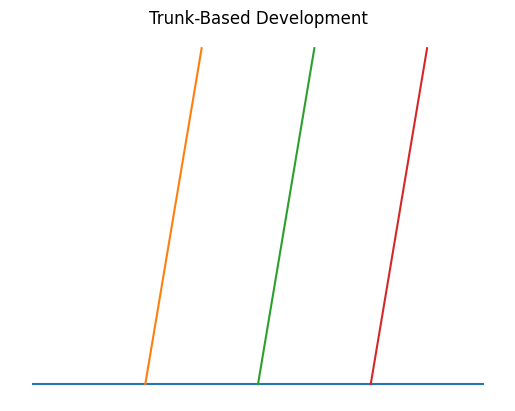
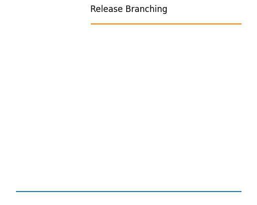
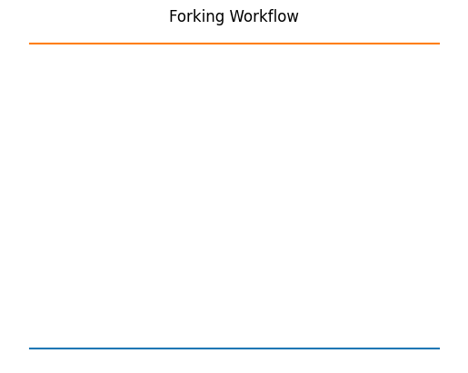

# Branching Strategies (Visual Guide)

This guide explains major Git branching strategies with visual diagrams.

---

## 1️⃣ Feature Branch Workflow

**Pros**
- Isolated feature development
- Easy pull request review

**Cons**
- Merge conflicts possible
- Long-lived branches risk drift

---

## 2️⃣ Git Flow

**Pros**
- Structured release management
- Clear branch roles

**Cons**
- More complex workflow
- Overhead for small teams

---

## 3️⃣ Trunk-Based Development

**Pros**
- Fast integration
- Encourages CI/CD

**Cons**
- Requires discipline
- Needs strong automated testing

---

## 4️⃣ Release Branching

**Pros**
- Stable production versions
- Easier hotfix handling

**Cons**
- Branch maintenance overhead
- Risk of branch drift

---

## 5️⃣ Forking Workflow

**Pros**
- Ideal for open source
- Safe external contributions

**Cons**
- Requires fork synchronization
- Slightly more complex flow

---

Choose strategy based on team size, release cycle, and CI maturity.
